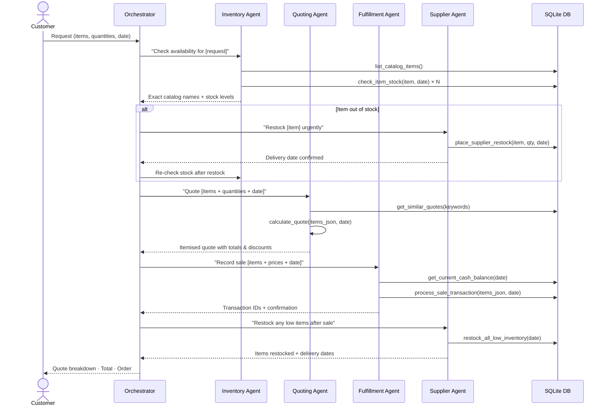
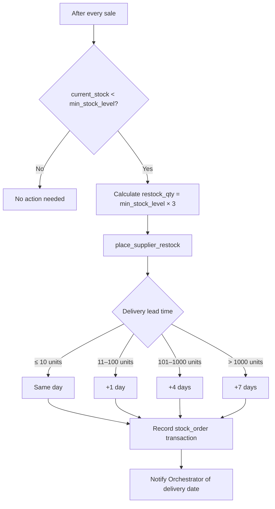
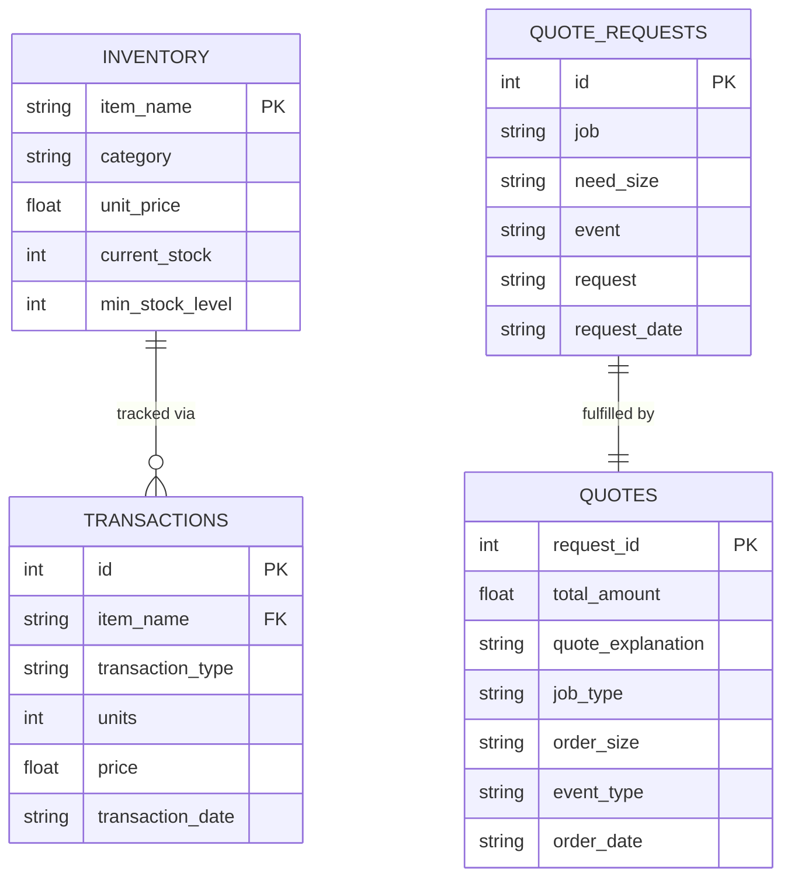

# Beaver's Choice Paper Company — Multi-Agent System Design

## Overview

The system handles customer inquiries end-to-end using five specialised agents
coordinated by a central orchestrator. All inputs and outputs are text-based.
The agents share a SQLite database and a product catalogue defined in code.

---

## Agent Roster (≤ 5 agents)

| Agent | Role |
|---|---|
| **Orchestrator** | Receives every customer request, decides the workflow, calls sub-agents in sequence, and compiles the final customer-facing response. |
| **Inventory Agent** | Maps natural-language item names to exact catalogue entries and checks current stock levels. |
| **Quoting Agent** | Looks up historical quotes for context, then calculates an itemised price with tiered bulk discounts. |
| **Fulfillment Agent** | Verifies the company cash position and records confirmed sale transactions in the database. |
| **Supplier Agent** | Places restock orders with the supplier for any item whose inventory has fallen below its minimum threshold. |

---

## Tool Roster

| Tool | Owner Agent | Backing Helper(s) | Purpose |
|---|---|---|---|
| `list_catalog_items` | Inventory | *(catalogue constant)* | Returns every item name and unit price from the in-memory `paper_supplies` list — used to map customer descriptions to exact catalogue names. |
| `check_item_stock` | Inventory | `get_stock_level` | Returns the net stock for one named item as of a given date; returns 0 if the item has never been stocked or is fully sold. |
| `list_available_inventory` | Inventory | `get_all_inventory` | Returns a dict of all items whose current net stock is > 0; useful for a broad availability overview. |
| `get_similar_quotes` | Quoting | `search_quote_history` | Searches historical quotes by keyword across request text and quote explanations; used to benchmark new quotes against past pricing. |
| `calculate_quote` | Quoting | *(CATALOG_PRICES constant)* | Pure-Python pricing engine: applies tiered per-item bulk discounts and an order-level multi-item discount, returning a full itemised breakdown. |
| `get_current_cash_balance` | Fulfillment | `get_cash_balance` | Returns the company's net cash (sales revenue minus stock purchases) as of a given date; used before recording a sale to confirm solvency. |
| `process_sale_transaction` | Fulfillment | `get_stock_level` + `create_transaction` | Verifies available stock, then writes a `sales` record via `create_transaction`; returns transaction IDs on success. |
| `place_supplier_restock` | Supplier | `get_supplier_delivery_date` + `create_transaction` | Computes delivery date based on quantity, costs the order at catalogue unit price, and writes a `stock_orders` record via `create_transaction`. |
| `restock_all_low_inventory` | Supplier | `get_stock_level` + *(calls `place_supplier_restock` logic)* | Iterates every row in the `inventory` reference table; for each item whose current stock < `min_stock_level`, places an order for 3× the minimum. |

---

## Bulk Discount Policy

Applied automatically inside `calculate_quote`:

| Units per line item | Discount |
|---|---|
| > 5 000 | 15 % |
| > 1 000 | 10 % |
| > 200 | 5 % |
| ≤ 200 | 0 % |

Orders with **more than one valid line item** receive an additional **5 % order-level discount** on the subtotal.

---

## System Architecture

---

## Request Processing Flow

---

## Inventory Reorder Logic

---

## Data Model (Key Tables)

---

## Helper Functions Provided in the Starter Code

These functions form the data layer that agent tools are built on.
Each tool is a thin wrapper that calls one or more of these helpers.

| Function | Description |
|---|---|
| `generate_sample_inventory(paper_supplies, coverage, seed)` | Randomly selects `coverage × N` items from the full catalogue and assigns each a starting stock (200–800 units) and minimum stock level (50–150 units). Used once by `init_database` to seed the `inventory` table. Not called by agents directly. |
| `init_database(db_engine, seed)` | One-time setup: creates the `transactions`, `quote_requests`, `quotes`, and `inventory` tables; loads the CSV files; and inserts an opening cash entry of $50,000 plus one `stock_orders` transaction per stocked item. Called by `run_test_scenarios` before any agent is invoked. |
| `create_transaction(item_name, transaction_type, quantity, price, date)` | Appends one row to the `transactions` table. `transaction_type` must be `'sales'` (reduces effective inventory, adds revenue) or `'stock_orders'` (adds inventory, costs cash). Returns the new row ID. **Both sale and restock tools call this.** |
| `get_all_inventory(as_of_date)` | Computes net stock per item (sum of `stock_orders` minus sum of `sales`) up to and including the given date. Returns a `{item_name: stock}` dict containing only items with stock > 0. **Backs the `list_available_inventory` tool.** |
| `get_stock_level(item_name, as_of_date)` | Same net-stock calculation as `get_all_inventory` but for a single named item; always returns a row even if stock is zero. **Backs the `check_item_stock` tool and the stock-verification step inside `process_sale_transaction`.** |
| `get_supplier_delivery_date(input_date_str, quantity)` | Returns the estimated delivery date by adding a lead-time offset to the order date: same day (≤10 units), +1 day (≤100), +4 days (≤1000), +7 days (>1000). **Used inside the `place_supplier_restock` tool to set the delivery date on the restock transaction.** |
| `get_cash_balance(as_of_date)` | Reads all transactions up to the given date and returns `total_sales − total_stock_purchases`. The opening $50,000 entry is counted as a `sales` record. **Backs the `get_current_cash_balance` tool.** |
| `generate_financial_report(as_of_date)` | Combines `get_cash_balance`, a per-item stock valuation loop using `get_stock_level`, and a top-5 revenue query to produce a full financial snapshot dict. Used by `run_test_scenarios` to track state between requests; not exposed as an agent tool (too expensive to call in a tight loop). |
| `search_quote_history(search_terms, limit)` | Joins `quotes` with `quote_requests` and filters rows where either the original request text or the quote explanation contains any of the given keywords (case-insensitive LIKE). Returns up to `limit` records ordered by most recent date. **Backs the `get_similar_quotes` tool.** |
| `run_test_scenarios()` | The test harness: initialises the database, loads `quote_requests_sample.csv`, iterates over each request in date order, calls the multi-agent system, re-reads the financial position after each call, and saves all results to `test_results.csv`. |

> **Note:** `search_quote_history` references the column `qr.response` in its SQL query,
> but the `quote_requests` table stores the text in a column named `request`
> (matching the CSV header). This is a bug in the starter code; the query will
> silently return zero results until the column name is corrected to `qr.request`.

---

### Why smolagents?
`smolagents` is chosen as the orchestration framework because:
- Its `ToolCallingAgent` + `ManagedAgent` pattern maps cleanly to a hierarchical multi-agent design.
- It integrates directly with any OpenAI-compatible API via `OpenAIServerModel`.
- Tools are defined with simple Python `@tool` decorators — no boilerplate schemas required.

### Why five agents (not fewer)?
Separating Inventory, Quoting, Fulfillment, and Supplier concerns keeps each agent's tool set small and its system prompt focused. A single monolithic agent would struggle to reliably follow a four-step workflow within a single ReAct loop.

### Item name matching
Customers rarely use exact catalogue names. The Inventory Agent is given the full catalogue on every call and instructed to identify the closest matching canonical name before any stock check or quote is generated. This prevents silent misses where an item exists in stock under a slightly different name.

### Restock quantity = 3 × minimum
Ordering three times the minimum threshold avoids constant reordering while keeping the order size modest enough for next-day delivery on most items.
