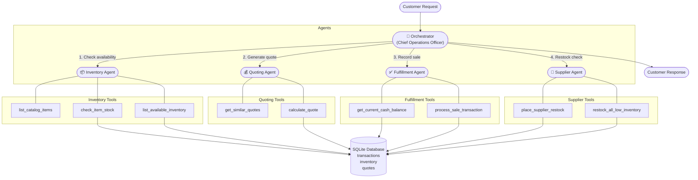
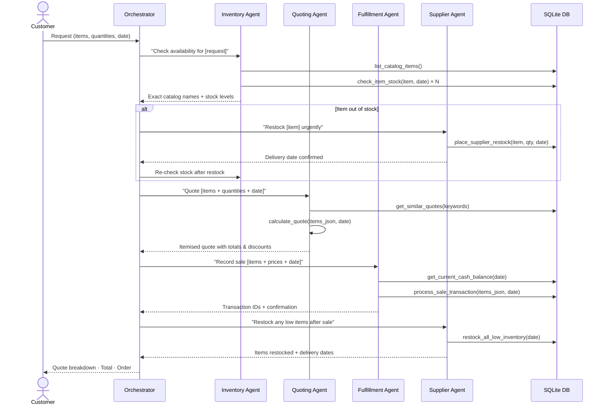
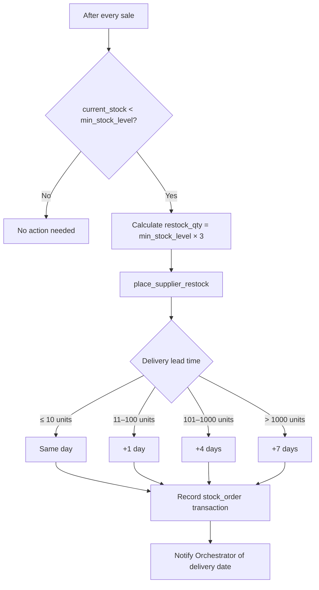
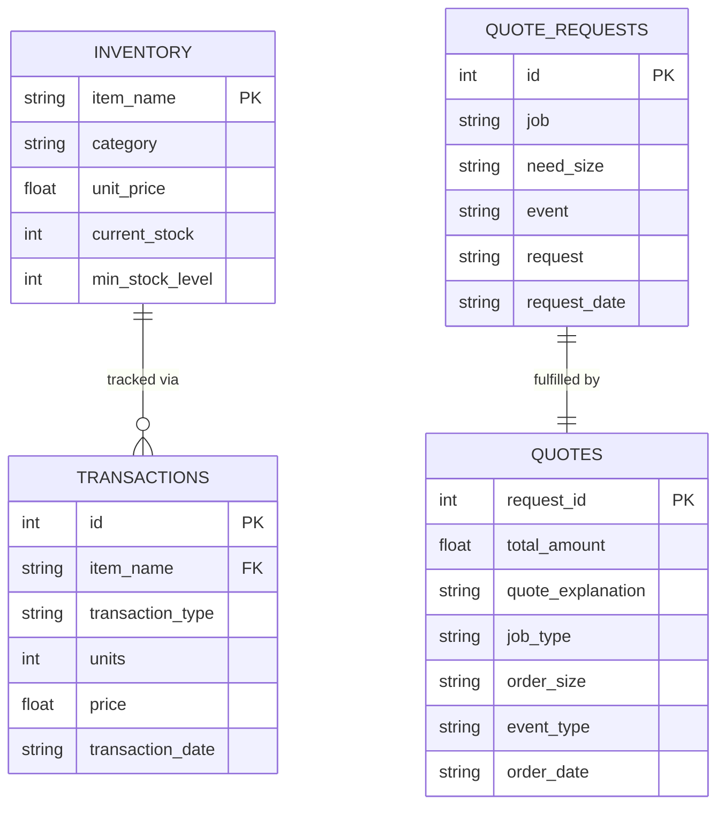

# Beaver's Choice Paper Company — Multi-Agent System Design

## Overview

The system handles customer inquiries end-to-end using five specialised agents
coordinated by a central orchestrator. All inputs and outputs are text-based.
The agents share a SQLite database and a product catalogue defined in code.

---

## Agent Roster (≤ 5 agents)

| Agent | Role |
|---|---|
| **Orchestrator** | Receives every customer request, decides the workflow, calls sub-agents in sequence, and compiles the final customer-facing response. |
| **Inventory Agent** | Maps natural-language item names to exact catalogue entries and checks current stock levels. |
| **Quoting Agent** | Looks up historical quotes for context, then calculates an itemised price with tiered bulk discounts. |
| **Fulfillment Agent** | Verifies the company cash position and records confirmed sale transactions in the database. |
| **Supplier Agent** | Places restock orders with the supplier for any item whose inventory has fallen below its minimum threshold. |

---

## Tool Roster

| Tool | Owner Agent | Purpose |
|---|---|---|
| `list_catalog_items` | Inventory | Returns every item name and unit price in the catalogue. |
| `check_item_stock` | Inventory | Returns the current stock level for one named item as of a given date. |
| `list_available_inventory` | Inventory | Returns all items that have stock > 0 on a given date. |
| `get_similar_quotes` | Quoting | Searches historical quotes by keyword for pricing benchmarks. |
| `calculate_quote` | Quoting | Applies tiered bulk discounts and returns an itemised quote total. |
| `get_current_cash_balance` | Fulfillment | Returns the company's net cash position on a given date. |
| `process_sale_transaction` | Fulfillment | Writes a sales record to the database after verifying sufficient stock. |
| `place_supplier_restock` | Supplier | Places a single-item purchase order; returns cost and delivery date. |
| `restock_all_low_inventory` | Supplier | Scans every tracked item and auto-restocks those below minimum levels. |

---

## Bulk Discount Policy

Applied automatically inside `calculate_quote`:

| Units per line item | Discount |
|---|---|
| > 5 000 | 15 % |
| > 1 000 | 10 % |
| > 200 | 5 % |
| ≤ 200 | 0 % |

Orders with **more than one valid line item** receive an additional **5 % order-level discount** on the subtotal.

---

## System Architecture

---

## Request Processing Flow

---

## Inventory Reorder Logic

---

## Data Model (Key Tables)

---

## Design Decisions

### Why smolagents?
`smolagents` is chosen as the orchestration framework because:
- Its `ToolCallingAgent` + `ManagedAgent` pattern maps cleanly to a hierarchical multi-agent design.
- It integrates directly with any OpenAI-compatible API via `OpenAIServerModel`.
- Tools are defined with simple Python `@tool` decorators — no boilerplate schemas required.

### Why five agents (not fewer)?
Separating Inventory, Quoting, Fulfillment, and Supplier concerns keeps each agent's tool set small and its system prompt focused. A single monolithic agent would struggle to reliably follow a four-step workflow within a single ReAct loop.

### Item name matching
Customers rarely use exact catalogue names. The Inventory Agent is given the full catalogue on every call and instructed to identify the closest matching canonical name before any stock check or quote is generated. This prevents silent misses where an item exists in stock under a slightly different name.

### Restock quantity = 3 × minimum
Ordering three times the minimum threshold avoids constant reordering while keeping the order size modest enough for next-day delivery on most items.
